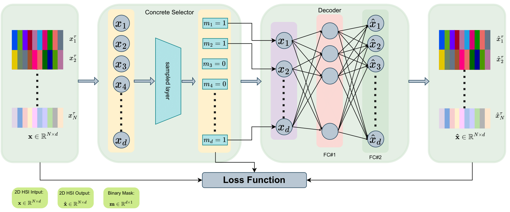

# DROPOUT CONCRETE AUTOENCODER FOR BAND SELECTION ON HSI SCENES
# PROFESSIONAL  README GENERATOR


[](https://choosealicense.com/licenses/mit/)



**Acknowledgment:** This code is mainly based on the works [dl_selection](https://github.com/iancovert/dl-selection.git). 


## I. Training.
./train.sh --cfg configs/xxx.yaml

## II. Prepare Data.
The project folder structure should look like this:
```commandlines
|--myHyper
  |-- $configs
  |   |-- KSC_T1.yaml
  |-- $datasets
  |   |-- KSC_gt.mat
  |   |-- KSC.mat
  |-- data.py
  |-- encoders.py
  |-- concreteVAE.py
  |-- utils.py
  |-- train.py
  |-- train.sh   


